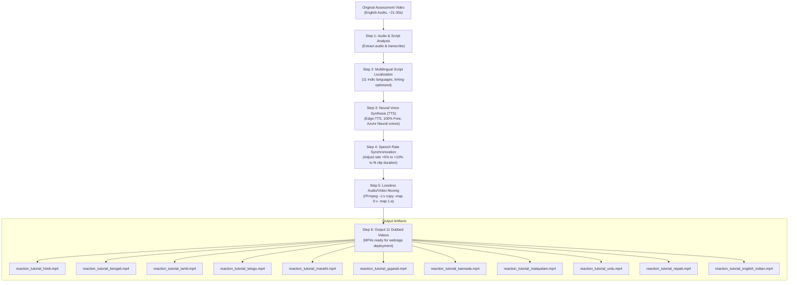

# 🎙️ 100% Free Multilingual Video Dubbing Workflow

A step-by-step technical guide and flow documentation for dubbing assessment tutorial videos into **11 Indian & regional languages** with **₹0 API cost**, **no subscriptions**, and **zero cloud dependencies**.

---

## 🗺️ High-Level Architecture Flow



---

## 🛠️ Stack & Dependencies (Zero Cost)

| Tool | Role | Cost | Why Chosen |
| :--- | :--- | :--- | :--- |
| **`edge-tts`** | Neural Voice Synthesis | **₹0 / Free** | Connects to Microsoft Azure Neural voices without requiring an Azure subscription, API key, or credit card. |
| **`imageio-ffmpeg`** | Video & Audio Muxing | **₹0 / Free** | Bundles standalone `ffmpeg` binary directly inside Python without requiring manual system PATH configurations. |
| **`asyncio` / Python 3.8+** | Batch Automation | **₹0 / Free** | Asynchronous execution with retry handling and socket recovery. |

---

## 📋 Step-by-Step Implementation Guide

### Phase 1: Environment Setup

Install the required free libraries:

```bash
python -m pip install edge-tts imageio-ffmpeg aiohttp
```

Verify that the local FFmpeg binary is accessible:

```bash
python -c "import imageio_ffmpeg; print(imageio_ffmpeg.get_ffmpeg_exe())"
```

---

### Phase 2: Audio Extraction & Transcription

1. Extract the audio track from the original tutorial video:
   ```bash
   ffmpeg -i "input_tutorial.mp4" -vn -acodec pcm_s16le -ar 16000 -ac 1 "extracted_audio.wav" -y
   ```
2. Transcribe the spoken text. For example, the Reaction Time tutorial video transcript:
   > *"Begin the assessment. React to the color green by either clicking on the screen or using your spacebar. Now, clicking before the color changes results in a false start. Keep this in mind and perform the rest of the levels."*

---

### Phase 3: Script Localization (Timing-Optimized)

Indic languages (Hindi, Tamil, Telugu, etc.) often require **15%–25% more syllables** to say the same message. 

> [!IMPORTANT]
> Keep translations concise and crisp so the generated speech comfortably finishes **2 to 3 seconds before the video ends**.

#### Voice & Speech Rate Configuration Matrix:

| Language | Locale Code | Edge-TTS Voice Name | Gender | Rate Adjustment | Target File |
| :--- | :--- | :--- | :--- | :--- | :--- |
| **Hindi** | `hi-IN` | `hi-IN-SwaraNeural` | Female | `+5%` | `reaction_tutorial_hindi.mp4` |
| **Bengali** | `bn-IN` | `bn-IN-TanishaaNeural` | Female | `+5%` | `reaction_tutorial_bengali.mp4` |
| **Tamil** | `ta-IN` | `ta-IN-PallaviNeural` | Female | `+10%` | `reaction_tutorial_tamil.mp4` |
| **Telugu** | `te-IN` | `te-IN-ShrutiNeural` | Female | `+8%` | `reaction_tutorial_telugu.mp4` |
| **Marathi** | `mr-IN` | `mr-IN-AarohiNeural` | Female | `+5%` | `reaction_tutorial_marathi.mp4` |
| **Gujarati** | `gu-IN` | `gu-IN-DhwaniNeural` | Female | `+5%` | `reaction_tutorial_gujarati.mp4` |
| **Kannada** | `kn-IN` | `kn-IN-SapnaNeural` | Female | `+8%` | `reaction_tutorial_kannada.mp4` |
| **Malayalam** | `ml-IN` | `ml-IN-SobhanaNeural` | Female | `+8%` | `reaction_tutorial_malayalam.mp4` |
| **Urdu** | `ur-IN` | `ur-IN-GulNeural` | Female | `+5%` | `reaction_tutorial_urdu.mp4` |
| **Nepali** | `ne-NP` | `ne-NP-HemkalaNeural` | Female | `+5%` | `reaction_tutorial_nepali.mp4` |
| **English (IN)** | `en-IN` | `en-IN-NeerjaNeural` | Female | `+0%` | `reaction_tutorial_english_indian.mp4` |

---

### Phase 4: Voice Synthesis & Lossless Video Remuxing

The Python script (`scripts/dub_free_workflow.py`) performs two automated steps for every language:

#### 1. Generate Voice Audio (`.mp3`):
```python
import edge_tts

comm = edge_tts.Communicate(text, voice_name, rate="+5%")
await comm.save(audio_output_path)
```

#### 2. Losslessly Merge with Video (`.mp4`):
```python
import subprocess

cmd = [
    ffmpeg_exe, "-y",
    "-i", video_input_path,       # Source video
    "-i", audio_input_path,       # Dubbed audio
    "-c:v", "copy",               # Zero re-encoding: instant and preserves 100% video quality
    "-c:a", "aac",                # High-fidelity AAC audio
    "-b:a", "128k",
    "-map", "0:v:0",              # Select video stream from original
    "-map", "1:a:0",              # Select audio stream from generated TTS
    "-shortest",                  # Prevent video freezing if audio finishes early
    video_output_path
]
subprocess.run(cmd, check=True)
```

---

### Phase 5: How to Run for the Remaining 6 Videos

To dub any new assessment tutorial video:

1. Place the new tutorial `.mp4` into the workspace (e.g. `tutorial_story.mp4`).
2. Update the `video_input` variable and the localized text dictionary in [`scripts/dub_free_workflow.py`](file:///c:/Users/Sashank%20Raviraj/AppData/Roaming/Desktop/CogniTrack/scripts/dub_free_workflow.py).
3. Run:
   ```bash
   python -u scripts/dub_free_workflow.py
   ```
4. All 11 localized video files will appear in [`dubbed_videos_output/`](file:///c:/Users/Sashank%20Raviraj/AppData/Roaming/Desktop/CogniTrack/dubbed_videos_output) ready to serve.

---

## 🎯 Key Advantages of this Approach

1. **Total Cost:** **₹0.00 / $0.00** (Eliminated ~$60-$90 commercial dubbing SaaS costs).
2. **Speed:** Video stream copying (`-c:v copy`) avoids re-rendering the visual frames, generating each video in under 2 seconds.
3. **Quality:** Azure Neural voices produce natural cadence, authentic regional accents, and human-like inflection.
4. **Resilience:** Built-in exponential backoff handles temporary socket timeouts automatically.
