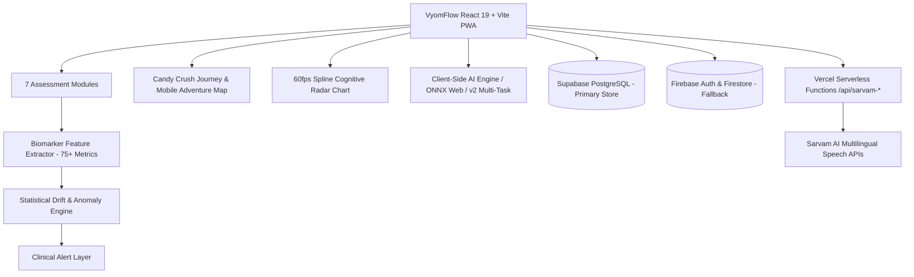
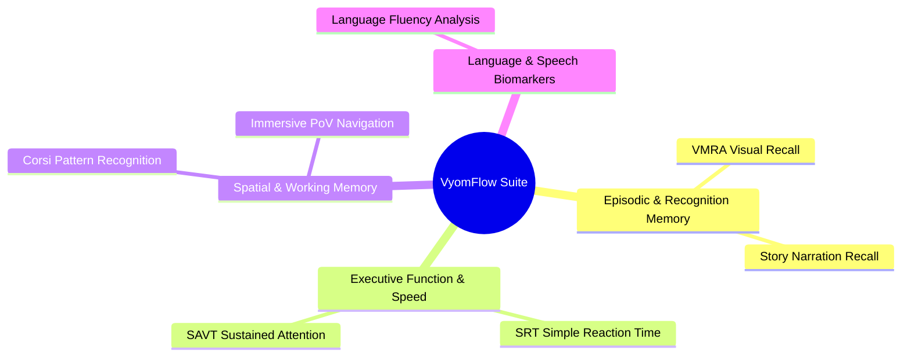
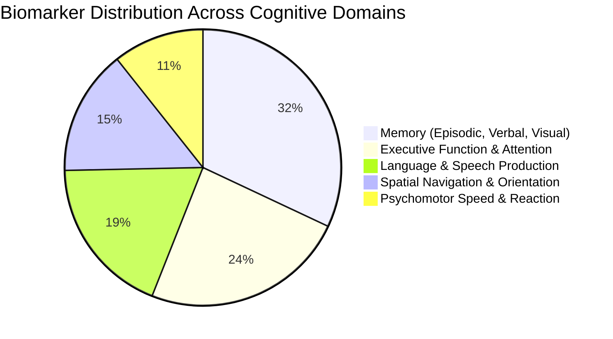
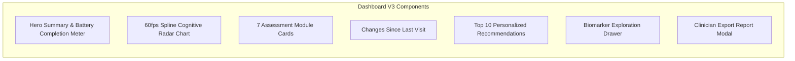

# VyomFlow — Product Requirements Document (PRD)

**Production Platform Specification: Multi-Modal Cognitive Assessment, In-Browser Clinical AI & Longitudinal Surveillance**  
**Version:** 3.0 | **Date:** September 2026 | **Author:** VyomFlow Engineering & Clinical AI Team  

---

## 1. Product Overview & Executive Summary

VyomFlow is a browser-based, clinically-aligned cognitive screening and longitudinal surveillance platform. Designed specifically for low-burden, repeated digital administration across diverse populations, VyomFlow replaces high-friction clinical battery appointments with **7 culturally inclusive, scientifically grounded digital assessment modules**.

Built as a high-performance Progressive Web Application (PWA) with client-side ML inference and resilient cloud storage (Supabase PostgreSQL + Firebase), VyomFlow enables early detection of subtle cognitive decline, mild cognitive impairment (MCI), and dementia indicators years before overt clinical manifestations.

### Core Value Propositions
- **Culture & Language Equity:** Eliminates Western-centric literacy and educational biases through language-free visual tests, 22+ Indic languages (with dynamic RTL support), and authentic Sarvam AI speech models.
- **Zero-Latency In-Browser AI:** Pure client-side ONNX Runtime Web and v2 Multi-Task model evaluation with zero patient data transmission required for inference.
- **Ecological & Immersive Validity:** First-person real-world PoV video navigation assessing spatial egocentric/allocentric memory.
- **Ethical & Non-Diagnostic Architecture:** Strict explainability guardrails, supportive non-stigmatizing risk communication, and automated clinician PDF report generation.

---

## 2. System Architecture & Tech Stack

| Layer | Technologies & Libraries | Responsibilities |
|---|---|---|
| **Frontend Framework** | React 19, TypeScript, Vite 7 | High-performance SPA with sub-second page transitions and PWA offline capability. |
| **Styling & UI Tokens** | Vanilla CSS Design System, Glassmorphism, CSS Modules | Responsive dark/light theme switching, WCAG AAA contrast, fluid typography. |
| **Cloud Database** | Supabase (PostgreSQL 15), Covering Indexes, Atomic RPCs | Primary high-throughput relational store for 75+ clinical biomarkers, offline retry queue. |
| **Authentication & Sync**| Firebase Auth (Google OAuth), Firestore SDK | User session identity, cross-device authorization, resilient offline-first syncing. |
| **In-Browser ML/AI** | ONNX Runtime Web, TF.js, Custom Kernel v2.1 | Instant inference of NACC-trained multi-task classifiers, SHAP explainability, radar projections. |
| **Speech & Audio AI** | Sarvam AI REST / WebSocket Streaming APIs | Multilingual Indian speech-to-text (Devanagari Hindi, Marathi, Tamil, etc.) and low-latency TTS. |
| **Cloud Functions** | Vercel Serverless TypeScript Functions (`@vercel/node`) | CORS-free proxies for Sarvam STT (`/api/sarvam-stt`) and translation (`/api/sarvam-translate`). |
| **Spatial Interaction** | MapLibre GL JS, `@dnd-kit/core`, `@dnd-kit/sortable` | 3D tile rendering, tactile landmark sequencing, multi-touch swipe / WASD / D-pad controls. |

---

## 3. The 7 Clinical Assessment Modules

---

### Module 1 — Visual Memory Recall Assessment (VMRA)
- **Route:** `/test/memory`, `/test/vmra` | **Duration:** ~2 minutes
- **Cognitive Domain:** Visual Recognition, Episodic Memory, Information Encoding.
- **Scientific Foundation:** Replaces culturally biased word-list recall (e.g., Rey Auditory Verbal Learning Test) with standardized Pan-Indian vector illustrations identifiable across all literacy levels.
- **Test Flow:**
  1. *Encoding Phase (25s):* 6 target illustrations presented sequentially (3s display + 1s inter-stimulus interval).
  2. *Retention Distractor (15s):* Odd-one-out shape matching to prevent phonological rehearsal.
  3. *Immediate Recall (Untimed):* 4×3 matrix containing 6 targets + 6 semantic distractors.
  4. *Delayed Recall (5 min interval):* Re-tested with altered grid matrix and novel distractor pool.
- **Biomarkers & Telemetry:**
  - `recallAccuracy` (Hits / Targets), `falsePositiveRate` (False Alarms / Distractors), `f1Score`.
  - `meanSelectionLatencyMs`, `firstTapLatencyMs`, `latencyVariance`.
  - `primacyBias`, `recencyBias`, `midListDeficit` positional serialization.
  - Spatial quadrant selection bias and random-tapping heuristics (`possibleRandomTapping` flag if latency < 300ms).

---

### Module 2 — Simple Reaction Time (SRT)
- **Route:** `/test/reaction` | **Duration:** ~1 minute
- **Cognitive Domain:** Psychomotor Processing Speed, Baseline Alertness, Neuro-Muscular Response.
- **Test Flow:**
  - 1 practice calibration round followed by 5 scored rounds.
  - Variable randomized pre-stimulus interval (2000ms – 5000ms) to eliminate anticipatory conditioning.
  - Instant visual trigger; tactile tap or spacebar response.
- **Biomarkers & Telemetry:**
  - `meanRT`, `medianRT`, `minRT`, `maxRT`, `rtVariance`.
  - `fatigueSlope` (Ordinary least-squares regression across rounds showing vigilance decay).
  - `stabilityIndex` ($1 - \text{CoV}$), `falseStartCount`, `timeoutCount` (>3000ms).

---

### Module 3 — Corsi Pattern Recognition (Visual Sequence Memory)
- **Route:** `/test/pattern` | **Duration:** ~2 minutes
- **Cognitive Domain:** Visuo-Spatial Working Memory Span, Executive Sequencing.
- **Scientific Foundation:** Standardized computerized adaptation of the Corsi Block Tapping Task.
- **Difficulty Scaling Matrix:**
  | Difficulty Level | Grid Dimensions | Sequence Span | Inter-Tap Timeout |
  |---|---|---|---|
  | Level 1–2 | 3×3 (9 blocks) | 3 items | 5000ms |
  | Level 3–4 | 3×3 (9 blocks) | 4 items | 4500ms |
  | Level 5–6 | 4×4 (16 blocks) | 5 items | 4000ms |
  | Level 7–8 | 4×4 (16 blocks) | 6 items | 3500ms |
  | Level 9+ | 5×5 (25 blocks) | 7+ items | 3000ms |
- **Biomarkers & Telemetry:**
  - `maxSpanLevelReached`, `totalRoundsPassed`, `responseLatencyToFirstBlock`.
  - `sequenceAccuracyTrend`, `learningRate`, `errorGrowthRate`, `workingMemorySpanIndex`.

---

### Module 4 — Spontaneous Speech & Language Fluency
- **Route:** `/test/language` | **Duration:** ~2 minutes
- **Cognitive Domain:** Verbal Fluency, Semantic Retrieval, Syntactic Structure, Acoustic Coherence.
- **Architecture & Pipeline:**
  - Microphone capture with client-side Web Audio API RMS volume analysis.
  - Dual pipeline: Sarvam AI WebSocket speech streaming + Vercel serverless REST fallback (`/api/sarvam-stt`).
  - Automatic language identification supporting 22+ Indic languages + English.
- **Biomarkers & Telemetry (12 Core Biomarkers):**
  - `wordCount`, `speechDurationSec`, `wordsPerMinute` (WPM).
  - `lexicalDiversity` (Type-Token Ratio: Unique Words / Total Words).
  - `pauseCount`, `averagePauseDurationMs`, `pauseToSpeechRatio`.
  - `hesitationIndex` ($\frac{\text{Pauses} + \text{Fillers}}{\text{Total Words}}$), `fillerWordCount` ("um", "uh", "like", "matlab", etc.).
  - `phonemicFluencyScore`, `acousticStabilityScore`, `coherenceIndex`.

---

### Module 5 — Sustained Attention & Vigilance Test (SAVT)
- **Route:** `/test/attention`, `/test/savt` | **Duration:** ~3 minutes
- **Cognitive Domain:** Sustained Attention, Inhibitory Control, Vigilance Decrement.
- **Scientific Foundation:** Continuous Performance Test (CPT) with Go/No-Go paradigms.
- **Test Flow:**
  - Rapid sequence of visual stimuli presented at 800ms intervals (500ms display + 300ms mask).
  - High-frequency "Go" targets (80%) vs low-frequency "No-Go" distractors (20%).
  - Multi-block design across 3 sequential phases to measure time-on-task deterioration.
- **Biomarkers & Signal Detection Theory Metrics:**
  - **Hit Rate (HR):** $\frac{\text{Correct Target Presses}}{\text{Total Targets}}$.
  - **False Alarm Rate (FAR):** $\frac{\text{Incorrect Distractor Presses}}{\text{Total Distractors}}$.
  - **Sensitivity Index ($d'$):** $Z(\text{HR}) - Z(\text{FAR})$ (measures perceptual discrimination accuracy).
  - **Response Bias ($\beta$ / $c$):** Criterion placement (conservative vs. impulsive response strategy).
  - **Commission Errors:** Failure to inhibit response on No-Go trials (fronto-executive inhibition marker).
  - **Omission Errors:** Failure to press on Go trials (inattention lapse marker).
  - **Vigilance Decrement Slope:** Linear decay rate of $d'$ across consecutive blocks.

---

### Module 6 — Story Narration Recall Assessment
- **Route:** `/test/story` | **Duration:** ~3 minutes
- **Cognitive Domain:** Auditory Immediate Memory, Narrative Coherence, Delayed Verbal Recall.
- **Test Flow:**
  1. *Auditory Story Presentation:* Culturally tailored narrative synthesized via Sarvam AI TTS (pace: 0.85).
  2. *Retelling Phase:* Patient retells the story aloud; real-time audio captured and transcribed via Sarvam AI saaras:v4.
  3. *Comprehension Quiz:* 5 targeted multilingual multiple-choice questions assessing core story elements (characters, settings, sequence of events).
- **Biomarkers & Matching Engine:**
  - Dual-text keyword extraction and semantic matching against canonical reference scripts.
  - `verbatimElementRecallRate`, `thematicGistRecallScore`, `mcqComprehensionAccuracy`.
  - `narrativeCoherenceScore`, `chronologicalSequenceScore`, `confabulationIndex`.

---

### Module 7 — Immersive Real-World PoV Video Navigation
- **Route:** `/test/navigation` | **Duration:** ~3–4 minutes
- **Cognitive Domain:** Egocentric/Allocentric Spatial Orientation, Topographical Memory, Wayfinding.
- **Scientific Foundation:** Spatial disorientation and entorhinal cortex degradation are among the earliest hallmarks of preclinical Alzheimer's disease. VyomFlow utilizes first-person PoV continuous video traversal through realistic Indian environments.
- **Test Architecture:**
  1. *Encoding Video Traversal:* Patient watches a smooth first-person walk along an environmental route with distinctive cultural landmarks (markets, temples, transit junctions).
  2. *Waypoint Decision Trials:* Traversal pauses at intersections; user selects forward directions via arrowpad, WASD, numpad, or mobile touch swipes.
  3. *Reverse Route Navigation:* Continuous backward traversal testing mental rotation and path reconstruction.
  4. *Landmark Drag-and-Drop Sequencing:* Accessible `@dnd-kit` interface where users re-order 6 randomly presented landmarks in the chronological order encountered.
- **Biomarkers & Telemetry:**
  - `waypointAccuracy` (Correct turns / Total decision junctions).
  - `decisionLatencyMs` (Time-to-decision at intersections).
  - `landmarkOrderDistance` (Kendall tau / Spearman distance from ground-truth order).
  - `reverseNavigationScore`, `spatialDisorientationEvents`, `allocentricIntegrationIndex`.

---

## 4. Comprehensive Digital Biomarker Catalog (75+ Metrics)

VyomFlow extracts **83 raw biomarkers** that synthesize into **75 validated clinical indices** structured across 5 cognitive domains:

| Domain | Key Clinical Biomarkers | Standard Normative Reference | Clinical Alert Threshold |
|---|---|---|---|
| **Episodic Memory** | VMRA Hits, F1 Score, Retention Ratio | $\ge 85\%$ accuracy | $< 65\%$ or $> 2$ SD drop from baseline |
| **Working Memory** | Corsi Span, Sequence Accuracy Slope | Span $\ge 5.5$ (young), $\ge 3.8$ (65+) | Span $\le 2$ or steep error growth |
| **Processing Speed** | Simple RT Mean, RT Variance | $240\text{ms} - 320\text{ms}$ | $> 410\text{ms}$ or CoV $> 0.35$ |
| **Sustained Attention**| $d'$ Sensitivity, Commission Errors, Vig. Slope | $d' \ge 2.8$, Commission $< 5\%$ | $d' < 1.6$ or Vigilance Slope $< -0.25$ |
| **Language & Fluency**| WPM, Lexical Diversity (TTR), Hesitation Index| WPM $130-160$, Hesitation $< 0.04$ | WPM $< 95$ or Hesitation $> 0.08$ |
| **Verbal Narrative** | Gist Recall, Chronological Sequence Score | Gist $\ge 80\%$, MCQ $\ge 4/5$ | Gist $< 50\%$ or MCQ $\le 2/5$ |
| **Spatial Navigation**| Waypoint Accuracy, Landmark Kendall's $\tau$ | Accuracy $\ge 85\%$, $\tau \ge 0.75$ | Accuracy $< 60\%$, $\tau < 0.35$ |

---

## 5. In-Browser Machine Learning & Clinical Decision Support

### 5.1 NACC Cohort & Dataset Foundation
- **Dataset:** 83,461 clinical participant records from the **National Alzheimer's Coordinating Center (NACC)** Uniform Data Set (UDS).
- **Clinical Target:** Montreal Cognitive Assessment (MoCA) score prediction and 3-tier clinical categorization:
  1. *Normal Cognition (NC):* MoCA $26 - 30$.
  2. *Mild Cognitive Impairment (MCI):* MoCA $18 - 25$.
  3. *Dementia / Severe Decline:* MoCA $< 18$.

### 5.2 VyomFlow v2 Multi-Task Model
- **Model Architecture:** Multi-output gradient-boosted tree ensemble and lightweight feed-forward neural kernel (`public/models/vyomflow_v2/model_bundle.json`).
- **Input Features (19 Standardized Clinical Inputs):**
  Demographics (Age, Sex, Education Level), VMRA Accuracy, Delayed Recall Ratio, SRT Mean Latency, SRT Variance, SAVT $d'$, SAVT Commission Error Rate, Corsi Max Span, Corsi Latency, Speech WPM, Lexical Diversity, Hesitation Index, Story Gist Recall, Waypoint Navigation Accuracy, Landmark Kendall's Tau.
- **Inference Execution:** Pure client-side via JavaScript engine and `onnxruntime-web` WebAssembly execution. **Zero raw assessment telemetry leaves the client browser for inference.**

### 5.3 Statistical Drift & Anomaly Engine
- Tracks participant's personal longitudinal rolling baseline ($N \ge 3$ sessions).
- Computes **Z-score performance drift** across each domain:
  $$Z_i = \frac{x_{i,\text{current}} - \mu_{i,\text{baseline}}}{\sigma_{i,\text{baseline}}}$$
- Triggers tiered clinical alert flags:
  - **Tier 1 (Green / Stable):** $|Z| < 1.5$ on all domains.
  - **Tier 2 (Amber / Observation):** $1.5 \le |Z| < 2.5$ on 1 or 2 domains across consecutive sessions.
  - **Tier 3 (Red / Urgent Clinical Review):** $|Z| \ge 2.5$ or concurrent drops across 3+ domains.

---

## 6. Dashboard V3 Architecture & Clinician Reporting

VyomFlow Dashboard V3 (`/dashboard`) provides a responsive, multi-perspective clinical control room:

### Key UI Capabilities:
1. **60fps Continuous Spline Cognitive Radar Chart:** Visualizes the 5 cognitive pillars with animated time-lapse scrubber across past historical assessments.
2. **Biomarker Drawer (`BiomarkerDrawer.tsx`):** Deep drill-down inspecting all raw metrics with normative age-matched bell curve visualizations.
3. **Automated Clinician Report Modal:** Single-click generation of structured clinical summaries including domain breakdown, longitudinal trajectory, anomaly flags, and print-ready PDF export.
4. **Gamified Candy Crush Journey Map:** Visual milestone roadmap with organic winding nodes, tactile level unlocking, and rolling 7-day battery protocol windows.

---

## 7. Cloud Storage, Database & Offline Resilience

### 7.1 Supabase Cloud PostgreSQL Schema
VyomFlow utilizes a normalized PostgreSQL relational database (`supabase/schema.sql`):
- `profiles`: User demographics, education tier, language preferences, clinical study ID.
- `assessment_sessions`: Session metadata, completion status, client device telemetry, battery duration.
- `biomarker_records`: Granular 75+ metrics per test module with JSONB structured payloads.
- `clinical_alerts`: Automated anomaly flags, severity levels, review acknowledgments.
- **Covering Indexes:** B-tree and GIN indexes on `(user_id, test_type, created_at DESC)` for instant query response.
- **Stored Procedures:** Atomic RPC `submit_full_assessment_battery()` ensuring all-or-nothing transactional integrity.

### 7.2 Offline Write Queue
- Local queue managed in `localStorage` / `IndexedDB`.
- If connectivity drops during an assessment, results are queued and tagged with a client UUID.
- Exponential backoff background worker automatically syncs results upon reconnection without user intervention.

---

## 8. Internationalization (i18n), Accessibility & Ethical Guardrails

### 8.1 22+ Indic Languages & RTL Support
- Full localization across 22 Scheduled Indian Languages + English:
  *Hindi, Bengali, Telugu, Marathi, Tamil, Urdu, Gujarati, Kannada, Odia, Malayalam, Punjabi, Assamese, Maithili, Santali, Kashmiri, Nepali, Konkani, Dogri, Sindhi, Bodo, Sanskrit, Manipuri.*
- **Dynamic RTL DOM Re-alignment:** Bidirectional text rendering engine that automatically flips flex containers, padding, and iconography when Urdu, Kashmiri, or Sindhi is selected.

### 8.2 Ethical & Supportive Clinical Communication
1. **Strict Non-Diagnostic Stance:** VyomFlow never provides a diagnosis of Alzheimer's or dementia. All user-facing copy uses constructive, non-alarmist terminology (e.g., *"Cognitive Vitality Steady"*, *"Changes Observed — Share with your Physician"*).
2. **Obfuscation of Raw Stressful Numbers:** Users see intuitive 5-star ratings, colored vitality rings, and percentile bands. Raw milliseconds and complex Z-scores are reserved for the Clinician Portal.
3. **Random Guessing Filtering:** Sessions flagged with `possibleRandomTapping` or extreme false starts are quarantined from the longitudinal trendline to prevent inaccurate decline alerts.
4. **Zero-Knowledge Inference Option:** Patients can operate VyomFlow completely anonymously in Guest Mode with local-only browser storage.

---

## 9. Verification & Quality Assurance Standards

| Component | Automated Testing Suite | Pass Criteria |
|---|---|---|
| **Clinical Model Engine** | `src/services/__tests__/clinicalModelEngine.test.ts` | 100% test pass on all 19 NACC feature mappings & edge cases. |
| **Statistical Drift** | `src/services/__tests__/statisticalDriftEngine.test.ts` | Correct Z-score drift alerts across simulated normal vs. declining cohorts. |
| **Clinical Alerts** | `src/services/__tests__/clinicalAlertService.test.ts` | Verifies Tier 1/2/3 alert escalation logic and boundary conditions. |
| **Production Build** | `npm run build` (Vite 7 + TypeScript 5.9) | Clean compile with 0 type errors, 0 unused variables, and bundle size optimization. |
| **PWA & Offline** | Chrome DevTools Lighthouse / Network Throttling | Service worker asset caching, offline assessment execution, seamless auto-sync. |
