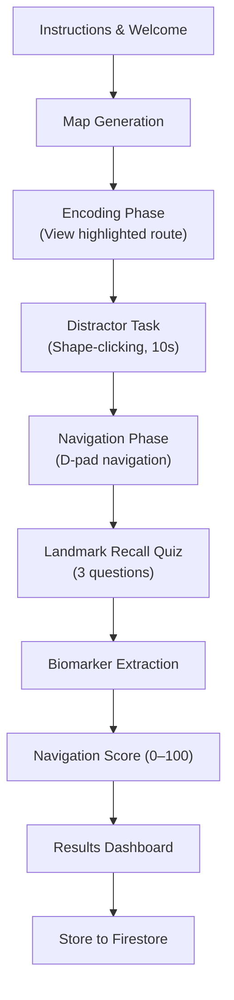

# Navigation Assessment Module — Implementation Plan

Build a complete, production-ready **Navigation Assessment** for VyomFlow that measures visuospatial memory, spatial orientation, executive planning, working memory, and decision-making through an interactive 2D Indian-themed map navigation task.

---

## User Preferences Summary

| Decision | Choice |
|---|---|
| Map Rendering | Pure SVG in React |
| Navigation Input | D-pad buttons (Up/Down/Left/Right) |
| Difficulty Progression | Start Level 1, auto-advance on score ≥ 70 |
| Distractor Task | Shape-clicking (active interference) |
| Landmark Recall Questions | 3 questions |
| Visual Style | Flat-design with emoji-style landmark icons + pastel roads |
| Encoding Timer | Difficulty-scaled: 15s → 12s → 10s → 8s |
| Route Generation | Pre-built curated map templates + randomized landmark placement |
| Results Display | Detailed dashboard with biomarker charts + route replay |
| Integration | Full — Tests page, routing, Firestore, Dashboard |

---

## Assessment Flow



---

## Proposed Changes

### Types Layer

#### [NEW] [navigationTypes.ts](file:///c:/Users/Sashank/Documents/Cmrit_Expo/Dev_file/Biomed/src/types/navigationTypes.ts)

Define all TypeScript interfaces for the module:

- **`MapNode`** — `{ id, label, emoji, x, y, isStart, isDestination, landmark? }`
- **`MapEdge`** — `{ from, to, weight, direction }` with direction as `'north' | 'south' | 'east' | 'west'`
- **`MapGraph`** — `{ nodes: MapNode[], edges: MapEdge[], optimalPath: string[] }`
- **`NavigationDifficulty`** — `1 | 2 | 3 | 4`
- **`MoveRecord`** — `{ timestamp, fromNode, toNode, decisionTimeMs, isCorrectMove, isBacktrack, distanceTravelled }`
- **`LandmarkRecallQuestion`** — `{ id, questionText, options: string[], correctAnswer: string }`
- **`LandmarkRecallResponse`** — `{ questionId, selectedAnswer, isCorrect, responseTimeMs }`
- **`NavigationBiomarkers`** — All 10 biomarkers defined in the PRD:
  - `navigationAccuracy` (0–1)
  - `pathEfficiency` (0–1)
  - `wrongTurnCount` (integer)
  - `completionTimeMs` (number)
  - `routeDeviation` (integer — extra edges taken)
  - `decisionLatencyMs` (average per junction)
  - `hesitationCount` (pauses > 2s)
  - `backtrackCount` (integer)
  - `landmarkRecallAccuracy` (0–1)
  - `planningEfficiency` (0–1, for Level 4)
- **`NavigationAssessmentResult`** — Full result object:
  - `id, sessionId, timestamp, difficulty, mapId`
  - `moves: MoveRecord[]`
  - `landmarkRecallResponses: LandmarkRecallResponse[]`
  - `biomarkers: NavigationBiomarkers`
  - `navigationScore: number` (0–100)
  - `totalMoves, optimalMoves, completionTimeMs`

---

### Map Data & Graph Algorithms

#### [NEW] [mapData.ts](file:///c:/Users/Sashank/Documents/Cmrit_Expo/Dev_file/Biomed/src/data/navigation/mapData.ts)

Pre-built curated map templates — **3–4 per difficulty level** (12–16 total maps).

Each map is a graph with:
- Node positions (x/y on an SVG grid)
- Edge connections with directional information
- Optimal path pre-calculated
- Landmark slots (randomized from the Indian Landmark Set at runtime)
- Landmark recall questions template

**Indian Landmark Set** (used for randomization):

| Emoji | Label |
|---|---|
| 🏠 | Home |
| 🏫 | School |
| 🏥 | Hospital |
| 🛕 | Temple |
| 🚏 | Bus Stop |
| 🛒 | Market |
| 💊 | Pharmacy |
| 🌳 | Park |
| 🚉 | Railway Station |
| 🏦 | Bank |
| 📚 | Library |
| 📮 | Post Office |

**Difficulty scaling:**

| Level | Intersections | Landmarks | Dead Ends | Valid Routes | Encoding Time |
|---|---|---|---|---|---|
| 1 | 5 | 2 | 0 | 1 | 15s |
| 2 | 8 | 4 | 1 | 1 | 12s |
| 3 | 10–12 | 5–6 | 2–3 | 1 | 10s |
| 4 | 12+ | 6–8 | 3+ | Multiple (1 optimal) | 8s |

#### [NEW] [graphAlgorithms.ts](file:///c:/Users/Sashank/Documents/Cmrit_Expo/Dev_file/Biomed/src/components/tests/navigation/utils/graphAlgorithms.ts)

Utility functions:
- **`findShortestPath(graph, startId, endId)`** — Dijkstra's algorithm returning optimal node sequence
- **`getAdjacentNodes(graph, nodeId)`** — Returns reachable neighbors
- **`getDirection(fromNode, toNode)`** — Returns compass direction
- **`comparePaths(optimalPath, actualPath)`** — Returns deviation metrics
- **`isOnOptimalPath(nodeId, optimalPath)`** — Checks if a node is on-route
- **`getAvailableDirections(graph, nodeId)`** — Returns which D-pad buttons should be active

---

### Component Layer

All components live under `src/components/tests/navigation/` following the existing module pattern (e.g., `story/`).

#### [NEW] [NavigationAssessment.tsx](file:///c:/Users/Sashank/Documents/Cmrit_Expo/Dev_file/Biomed/src/components/tests/navigation/NavigationAssessment.tsx)

**Top-level orchestrator** — manages phase state machine identical to the pattern in [StoryAssessment.tsx](file:///c:/Users/Sashank/Documents/Cmrit_Expo/Dev_file/Biomed/src/components/tests/story/StoryAssessment.tsx).

Phases: `instructions → encoding → distractor → navigation → landmark_recall → processing → results`

- Uses `PageWrapper` + `Card` + `Button` + `Icon` from common components
- Calls `useNavigationResults()` hook for Firestore persistence
- Manages state: current map, current difficulty, move history, phase transitions

#### [NEW] [NavigationAssessment.css](file:///c:/Users/Sashank/Documents/Cmrit_Expo/Dev_file/Biomed/src/components/tests/navigation/NavigationAssessment.css)

Comprehensive stylesheet covering:
- Map SVG container with responsive sizing
- Node/landmark styling with emoji rendering
- Road/edge styling (pastel colors, highlighted state for encoding)
- D-pad button layout (large touch targets ≥ 48px, mobile-friendly)
- HUD (timer, progress, current location)
- Encoding phase pulsing animation
- Color-blind-safe route highlighting (uses both color + pattern/dash)
- Results dashboard layout with chart containers
- Dark mode support via existing CSS variable system

#### [NEW] [MapBoard.tsx](file:///c:/Users/Sashank/Documents/Cmrit_Expo/Dev_file/Biomed/src/components/tests/navigation/components/MapBoard.tsx)

**Pure SVG map renderer.** Props:
- `graph: MapGraph` — The map data
- `currentNodeId: string` — User's current position (highlighted with pulsing indicator)
- `highlightedPath?: string[]` — Route to highlight during encoding (null during navigation)
- `visitedNodes: string[]` — Nodes already visited (subtle trail)
- `phase: 'encoding' | 'navigation'` — Controls visibility of route highlight

Renders:
- SVG `<line>` elements for roads (pastel gray default, highlighted color during encoding)
- SVG `<circle>` + `<text>` for nodes with emoji landmarks
- Pulsing current-position indicator (animated `<circle>`)
- Start marker (🟢) and destination marker (🏁)
- Dashed pattern overlay on highlighted route (color-blind accessible)

#### [NEW] [NavigationDpad.tsx](file:///c:/Users/Sashank/Documents/Cmrit_Expo/Dev_file/Biomed/src/components/tests/navigation/components/NavigationDpad.tsx)

D-pad controller with 4 directional buttons:
- Shows only available directions (grayed out / disabled for unavailable)
- Large touch targets (min 56px × 56px)
- Visual feedback on press (scale + color pulse)
- Calls `onMove(direction)` callback
- Mobile-optimized layout (centered below the map)

#### [NEW] [ShapeDistractor.tsx](file:///c:/Users/Sashank/Documents/Cmrit_Expo/Dev_file/Biomed/src/components/tests/navigation/components/ShapeDistractor.tsx)

Active interference distractor:
- Displays random shapes (circles, squares, triangles) appearing on screen
- User must tap the correct shape type (e.g., "Tap all circles!")
- 10-second timer with countdown display
- Auto-advances when timer expires
- Tracks tap accuracy (stored but not scored — purely for interference)

#### [NEW] [NavigationHUD.tsx](file:///c:/Users/Sashank/Documents/Cmrit_Expo/Dev_file/Biomed/src/components/tests/navigation/components/NavigationHUD.tsx)

Heads-Up Display overlay during navigation:
- Current location label (e.g., "You are at: 🏫 School")
- Destination reminder (e.g., "Go to: 🏁 Railway Station")
- Move counter (e.g., "Moves: 5")
- Elapsed time
- Progress bar (% of optimal path completed)

#### [NEW] [LandmarkRecall.tsx](file:///c:/Users/Sashank/Documents/Cmrit_Expo/Dev_file/Biomed/src/components/tests/navigation/components/LandmarkRecall.tsx)

Post-navigation quiz — 3 multiple-choice questions:
- Auto-generated from the map graph (e.g., "What landmark was directly north of the Hospital?")
- 4 options per question, one correct
- Tracks response time per question
- Uses same card/button styling as the Story Assessment's ComprehensionQuiz

#### [NEW] [NavigationResults.tsx](file:///c:/Users/Sashank/Documents/Cmrit_Expo/Dev_file/Biomed/src/components/tests/navigation/components/NavigationResults.tsx)

Detailed results dashboard:
- **Navigation Score** — large circular gauge (0–100)
- **Biomarker Breakdown** — horizontal bar chart showing each biomarker's contribution
- **Route Replay** — SVG overlay comparing optimal path (green) vs actual path (user's trail with red deviations)
- **Key Stats** — completion time, wrong turns, backtracks, decision latency
- **Landmark Recall** — score out of 3
- **Retake / Back** buttons
- **Level Auto-Advance Notice** — if score ≥ 70, show "Level X Unlocked!" animation

---

## Services Layer

#### [NEW] [NavigationScoring.ts](file:///c:/Users/Sashank/Documents/Cmrit_Expo/Dev_file/Biomed/src/components/tests/navigation/services/NavigationScoring.ts)

Scoring engine following the PRD weights:

```
Navigation Score = 
  (Navigation Accuracy × 0.30) +
  (Path Efficiency × 0.20) +
  (Wrong Turn Penalty × 0.15) +
  (Completion Time Score × 0.15) +
  (Route Deviation Score × 0.10) +
  (Decision Latency Score × 0.05) +
  (Backtracking Score × 0.05)
```

Each sub-score is normalized to 0–1 before weighting. Final score mapped to 0–100.

**Normalization Details:**
- **Completion Time Score** — compared against difficulty-specific expected times (e.g., Level 1: 30s expected → score = max(0, 1 - (actual - expected) / expected))
- **Wrong Turn Penalty** — `max(0, 1 - (wrongTurns / totalMoves))`
- **Decision Latency Score** — optimal ~1.5s; penalize both too fast (<0.5s, random guessing) and too slow (>5s)

#### [NEW] [NavigationAnalytics.ts](file:///c:/Users/Sashank/Documents/Cmrit_Expo/Dev_file/Biomed/src/components/tests/navigation/services/NavigationAnalytics.ts)

Extracts all 10 biomarkers from the raw move log:
- Processes `MoveRecord[]` array
- Compares against optimal path using graph algorithms
- Counts hesitations (pauses > 2000ms between moves)
- Identifies backtracks (returning to previously visited node)
- Computes landmark recall accuracy from quiz responses

---

## Hooks & Storage Layer

#### [NEW] [useNavigationResults.ts hook](file:///c:/Users/Sashank/Documents/Cmrit_Expo/Dev_file/Biomed/src/hooks/useNavigationResults.ts)

> [!IMPORTANT]
> This hook will be **added to the existing** [useTestResults.ts](file:///c:/Users/Sashank/Documents/Cmrit_Expo/Dev_file/Biomed/src/hooks/useTestResults.ts) file following the identical pattern used by `useStoryResults()` — Firestore-first, localStorage fallback.

- Collection name: `"navigation_results"`
- Append-only (no best-of-day logic — each session is unique)
- Exports: `{ results, isLoading, saveResult, getLatestResult }`

---

## Integration Points

#### [MODIFY] [firestoreService.ts](file:///c:/Users/Sashank/Documents/Cmrit_Expo/Dev_file/Biomed/src/services/firestoreService.ts)

Add `"navigation_results"` to the `ResultCollectionName` union type:
```diff
 export type ResultCollectionName =
     | "reaction_results"
     | "memory_results"
     | "pattern_results"
     | "language_results"
     | "vmra_results"
-    | "story_results";
+    | "story_results"
+    | "navigation_results";
```

Add to `clearAllFirestoreResults()` and `loadAllResultsFromFirestore()`.

#### [MODIFY] [Icon.tsx](file:///c:/Users/Sashank/Documents/Cmrit_Expo/Dev_file/Biomed/src/components/common/Icon.tsx)

Add a `"navigation"` icon to the `IconName` type and `iconPaths` map — a compass/map-pin style SVG path.

#### [MODIFY] [Tests.tsx](file:///c:/Users/Sashank/Documents/Cmrit_Expo/Dev_file/Biomed/src/pages/Tests.tsx)

- Add `"navigation"` to `TestType` union
- Add Navigation Assessment entry to the `TESTS` array:
  ```ts
  {
    id: "navigation",
    title: "Navigation Assessment",
    description: "Memorize and navigate an Indian-themed map to test visuospatial memory, planning, and orientation.",
    iconName: "navigation",
    duration: "4 min",
  }
  ```
- Add routing case in `handleStartTest`

#### [MODIFY] [App.tsx](file:///c:/Users/Sashank/Documents/Cmrit_Expo/Dev_file/Biomed/src/App.tsx)

Add protected route:
```tsx
<Route path="/test/navigation" element={
  <ProtectedRoute><NavigationAssessment /></ProtectedRoute>
} />
```

#### [MODIFY] [Dashboard.tsx](file:///c:/Users/Sashank/Documents/Cmrit_Expo/Dev_file/Biomed/src/pages/Dashboard.tsx)

Import and use `useNavigationResults()`. Display navigation score in the cognitive assessment summary section alongside existing test results.

#### [MODIFY] [useTestResults.ts](file:///c:/Users/Sashank/Documents/Cmrit_Expo/Dev_file/Biomed/src/hooks/useTestResults.ts)

- Add `navigationResults` to `STORAGE_KEYS`
- Add `useNavigationResults()` hook function (following `useStoryResults` pattern)
- Add navigation to `clearAllTestData()`

---

## File Summary

### New Files (14 files)

| File | Purpose |
|---|---|
| `src/types/navigationTypes.ts` | All TypeScript interfaces |
| `src/data/navigation/mapData.ts` | Pre-built map templates + landmark set |
| `src/components/tests/navigation/NavigationAssessment.tsx` | Top-level orchestrator |
| `src/components/tests/navigation/NavigationAssessment.css` | All styles |
| `src/components/tests/navigation/components/MapBoard.tsx` | SVG map renderer |
| `src/components/tests/navigation/components/NavigationDpad.tsx` | D-pad controller |
| `src/components/tests/navigation/components/ShapeDistractor.tsx` | Shape-clicking distractor |
| `src/components/tests/navigation/components/NavigationHUD.tsx` | HUD overlay |
| `src/components/tests/navigation/components/LandmarkRecall.tsx` | Post-nav quiz |
| `src/components/tests/navigation/components/NavigationResults.tsx` | Results dashboard |
| `src/components/tests/navigation/services/NavigationScoring.ts` | Scoring engine |
| `src/components/tests/navigation/services/NavigationAnalytics.ts` | Biomarker extraction |
| `src/components/tests/navigation/utils/graphAlgorithms.ts` | Graph utilities |
| `src/components/tests/navigation/index.ts` | Barrel export |

### Modified Files (5 files)

| File | Change |
|---|---|
| `src/services/firestoreService.ts` | Add `navigation_results` collection |
| `src/components/common/Icon.tsx` | Add `navigation` icon |
| `src/pages/Tests.tsx` | Add navigation test card |
| `src/App.tsx` | Add `/test/navigation` route |
| `src/hooks/useTestResults.ts` | Add `useNavigationResults` hook + storage key + clear |

---

## Verification Plan

### Automated Tests
```bash
npm run build
```
Verify zero TypeScript compilation errors across all new and modified files.

### Manual Verification
1. **Navigation Flow** — Walk through all phases on desktop + mobile viewport
2. **Encoding** — Confirm route highlights appear and disappear on timer
3. **D-pad** — Verify correct directional movement, disabled states, edge cases
4. **Distractor** — Shapes appear, timer counts down, auto-advances
5. **Landmark Quiz** — Questions auto-generated, answers scored correctly
6. **Scoring** — Verify Navigation Score matches expected formula output
7. **Route Replay** — Optimal vs actual path overlay renders correctly
8. **Level Progression** — Score ≥ 70 unlocks next level; < 70 stays
9. **Firestore** — Results persist across sessions for authenticated users
10. **Dashboard** — Navigation score appears alongside other test results
11. **Accessibility** — Touch targets ≥ 48px, high contrast, color-blind safe
12. **Responsive** — Test on 360px (mobile), 768px (tablet), 1200px+ (desktop)
