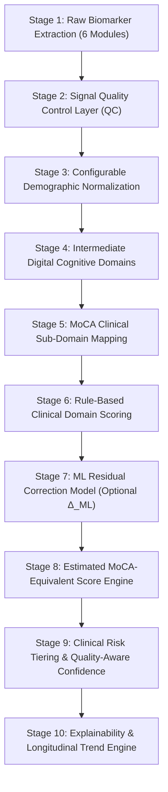

# VyomFlow: Digital Biomarker to Estimated MoCA-Equivalent Score Conversion Architecture

## Executive Summary & Architecture Philosophy

This document defines the production-grade conversion pipeline for translating multi-modal digital biomarkers extracted from VyomFlow's **6 core assessment modules** into an **Estimated MoCA-Equivalent Score** (also designated as **VyomFlow Cognitive Score – MoCA Aligned**).

### Core Architectural Principles
1. **Clinical Interpretability First**: Rule-based clinical domain logic forms the primary scoring engine. Machine Learning is restricted to a **Residual Correction Model** ($\Delta_{\text{ML}}$) to preserve 100% auditability.
2. **Zero Hard-Coded Hypotheses**: All sigmoid slopes, inflection points, weights, and demographic adjustment parameters are exposed via a **Configurable Calibration Parameter Interface** (`MoCACalibrationParams`), enabling empirical clinical tuning.
3. **Decoupled 10-Stage Pipeline**: Introduces an intermediate **Digital Cognitive Domain Layer** (e.g., Working Memory, Processing Speed, Executive Function) between raw biomarkers and clinical target scales. This decouples feature extraction from specific clinical instruments, allowing future expansion to MMSE, ACE-III, or custom cognitive indices.
4. **Signal Quality Control & Domain Reliability**: Every score is accompanied by an explicit **Quality Control (QC) Assessment** and per-domain **Reliability Metrics (0 – 100%)**.

---

## 1. Complete 10-Stage Explainable Pipeline



---

## 2. Pipeline Stage Specifications

### Stage 1: Multi-Modal Raw Biomarker Collection (6 Modules)
Extracts raw behavioral, psychomotor, acoustic, and cognitive timing metrics:
* **VMRA**: Spatial span recall accuracy, item placement error (px), retrieval latency (ms).
* **Story Recall**: Verbal response text, Information Unit (IU) hits, audio duration, silent pause count & duration (ms), speech signal-to-noise ratio (SNR), STT confidence.
* **Reaction Time**: Mean Simple RT (ms), Choice RT (ms), Response Time Variability ($\text{RTV} = \sigma_{\text{RT}}$), premature presses.
* **Pattern Recognition**: Matrix reasoning accuracy, decision latency per difficulty tier, distractor error distribution.
* **Language Task**: Acoustic pitch stability ($\sigma_{F0}$), Speech Rate (WPM), Silent Pause Ratio ($P_{\text{pause}}$), Type-Token Ratio (TTR).
* **Sustained Attention (SAVT)**: Hit rate, false alarm rate, signal detection sensitivity index ($d'$), response lapse count ($>2\sigma$).

---

### Stage 2: Signal Quality Control (QC) Layer
Before scoring, raw signals pass through a Quality Assessment filter to prevent invalid or noisy data from corrupting clinical estimates:

$$\text{QualityScore}_{\text{overall}} = w_{\text{audio}} \cdot Q_{\text{audio}} + w_{\text{stt}} \cdot Q_{\text{stt}} + w_{\text{compl}} \cdot Q_{\text{completion}} + w_{\text{consistency}} \cdot Q_{\text{consistency}}$$

```typescript
export interface QualityControlMetrics {
  audioSnrDb: number;            // Speech Signal-to-Noise Ratio (dB)
  sttConfidence: number;         // 0.0 - 1.0 (Speech-to-Text engine confidence)
  moduleCompletionRate: number;  // 0.0 - 1.0 (Percentage of assessment completed)
  reactionConsistencyIndex: number; // 0.0 - 1.0 (Flag erratic or random tapping)
  overallQualityScore: number;   // 0.0 - 100%
  qcPassed: boolean;             // True if overallQualityScore >= minimumQcThreshold
  qcFlags: string[];             // e.g. ["LOW_AUDIO_SNR", "HIGH_REACTION_ERRATICISM"]
}
```

---

### Stage 3: Configurable Demographic Normalization
Standardizes raw biomarkers based on age and years of formal education using configurable parameter schemas:

```typescript
export interface DemographicNormalizationConfig {
  educationBonusEnabled: boolean;     // Default: true
  educationThresholdYears: number;   // Default: 12 years
  educationBonusPoints: number;      // Default: +1.0 point
  ageNormalizationEnabled: boolean;   // Default: true
  ageBaselineYear: number;           // Default: 65 years
  ageDecayFactorPerDecade: number;   // Configurable linear/logistic slope
}
```

---

### Stage 4: Intermediate Digital Cognitive Domain Layer
Decouples raw test metrics from clinical instruments. Raw biomarkers map first into standardized **Digital Cognitive Domains** $[0.0, 100.0]$:

```
[Raw Biomarkers] ──► 1. Processing Speed Index (PSI)
                 ──► 2. Visuospatial Working Memory (VWM)
                 ──► 3. Executive Function & Reasoning (EFR)
                 ──► 4. Verbal Memory & Narrative Recall (VMNR)
                 ──► 5. Sustained Attention & Vigilance (SAV)
                 ──► 6. Lexical Access & Speech Acoustics (LASA)
```

---

### Stage 5 & 6: MoCA Clinical Sub-Domain & Deterministic Scoring Engine

Maps intermediate Digital Cognitive Domains into the 7 MoCA clinical sub-domains using **configurable transfer parameters**:

```typescript
export interface SigmoidParameters {
  slope: number;       // k parameter (steepness)
  inflection: number;  // theta parameter (midpoint)
  minClamp: number;    // Lower bound
  maxClamp: number;    // Upper bound (Max domain points)
}

export interface MoCACalibrationParams {
  visuospatialParams: SigmoidParameters; // Max 5.0 pts
  namingParams: SigmoidParameters;        // Max 3.0 pts
  delayedRecallParams: SigmoidParameters; // Max 5.0 pts
  attentionParams: SigmoidParameters;     // Max 6.0 pts
  languageParams: SigmoidParameters;      // Max 3.0 pts
  abstractionParams: SigmoidParameters;   // Max 2.0 pts
  orientationParams: SigmoidParameters;   // Max 6.0 pts
}
```

#### Speech & Story Recall Text Matching Strategy (Stage 6 Baseline)
By default, semantic embeddings (SBERT/OpenAI/Gemini) are an **optional feature flag enhancement**. The primary deterministic engine relies on lightweight, verifiable NLP metrics:
1. **Information Unit (IU) Matching**: Binary/weighted check of key story elements.
2. **Jaccard Token Similarity**: $J(A, B) = \frac{|A \cap B|}{|A \cup B|}$.
3. **Levenshtein Distance Ratio**: Text edit distance normalized by string length.
4. **Kendall's Tau ($\tau$)**: Evaluates correct chronological ordering of recalled events.
5. *(Optional)* **Vector Embedding Cosine Distance**: Enabled only when LLM/embedding service feature flag is turned ON.

---

### Stage 7: ML Residual Correction Model ($\Delta_{\text{ML}}$)
Machine Learning is used **strictly to refine** the rule-based clinical score rather than replacing it:

$$\text{FinalScore} = \text{ClinicalRuleScore} + \text{Clamp}\left(\Delta_{\text{ML}}, -\epsilon, +\epsilon\right)$$

* **Explainability Guarantee**: The base clinical score accounts for $\ge 90\%$ of the result. The ML residual $\Delta_{\text{ML}}$ is bounded (e.g. $\epsilon = \pm 1.5$ points) to capture complex non-linear cross-domain interaction effects without creating a black-box system.

---

### Stage 8: Estimated MoCA-Equivalent Score Engine
Calculates the aggregated score:

$$\text{Estimated MoCA-Equivalent Score} = \text{Clamp}\left( \sum_{i=1}^{7} S_{\text{rule}, i} + \Delta_{\text{ML}} + \text{Bonus}_{\text{demographic}}, 0.0, 30.0 \right)$$

---

### Stage 9: Clinical Risk Tiering & Quality-Aware Confidence

#### Qualitative Confidence Rating
Rather than issuing premature numerical statistical intervals prior to clinical trial calibration, the engine outputs a transparent **Qualitative Confidence Score**:

* 🟢 **HIGH CONFIDENCE**: Overall QC score $\ge 85\%$, all 6 assessment modules completed, audio SNR $> 20\text{dB}$.
* 🟡 **MEDIUM CONFIDENCE**: Overall QC score between $65\% – 84\%$, or 1 module incomplete.
* 🔴 **LOW CONFIDENCE**: Overall QC score $< 65\%$, high reaction erraticism, or low STT confidence.

#### Domain-Level Reliability Tracking
Every domain returns both its **Score** and **Reliability Percentage**:

```typescript
export interface DomainScoreResult {
  score: number;       // e.g. 4.2 / 5.0
  maxScore: number;    // e.g. 5.0
  reliability: number; // 0.0 - 100% (based on module QC and data completeness)
}
```

#### Clinical Risk Categories
```
Score Range      Clinical Designation                    Recommended Clinical Action
─────────────────────────────────────────────────────────────────────────────────────────────
26.0 – 30.0      🟢 Normal Cognitive Profile            Intact performance; annual re-assessment.
18.0 – 25.9      🟡 Mild Deficit (MCI-Aligned)           Subtle cognitive decline; 3-month follow-up.
10.0 – 17.9      🟠 Moderate Cognitive Impairment       Multi-domain deficit; clinical referral.
 < 10.0          🔴 Severe Cognitive Impairment         Prominent deficit; immediate clinical evaluation.
```

---

## 3. TypeScript Engine Interface (`src/utils/mocaScoringEngine.ts`)

```typescript
export interface CognitivePipelineInput {
  rawBiomarkers: Record<string, any>;
  qualityMetrics: QualityControlMetrics;
  demographics: { age: number; educationYears: number };
  calibrationConfig?: Partial<MoCACalibrationParams>;
  demographicConfig?: Partial<DemographicNormalizationConfig>;
  enableEmbeddingEnhancement?: boolean; // Default: false
}

export interface EstimatedMoCAResult {
  scoreTitle: "Estimated MoCA-Equivalent Score";
  totalScore: number; // 0.0 to 30.0
  qualitativeConfidence: "HIGH" | "MEDIUM" | "LOW";
  overallQualityScore: number; // 0.0 to 100%
  riskTier: "Normal" | "Mild Deficit (MCI-Aligned)" | "Moderate Impairment" | "Severe Impairment";
  
  domainBreakdown: {
    visuospatialExecutive: DomainScoreResult; // /5
    naming: DomainScoreResult;                // /3
    delayedRecall: DomainScoreResult;         // /5
    attentionVigilance: DomainScoreResult;    // /6
    languageFluency: DomainScoreResult;       // /3
    abstraction: DomainScoreResult;           // /2
    orientation: DomainScoreResult;           // /6
  };
  
  digitalDomains: {
    processingSpeedIndex: number;
    visuospatialWorkingMemory: number;
    executiveFunctionReasoning: number;
    verbalMemoryNarrativeRecall: number;
    sustainedAttentionVigilance: number;
    lexicalAccessSpeechAcoustics: number;
  };

  mlResidualAdjustment: number; // e.g. +0.3 or -0.4
  explainabilityReport: string[];
}
```

---

## 4. Key Advantages of the Improved Architecture

1. **Fully Configurable Calibration**: No hard-coded constants. All thresholds, sigmoid slopes, and demographic adjustments can be dynamically tuned as clinical validation trial data becomes available.
2. **Explainable ML Residual Model**: Maintains 100% clinician transparency by using ML only as a bounded residual correction $\Delta_{\text{ML}}$ on top of deterministic rule-based domain scores.
3. **Decoupled Architecture**: Intermediate Digital Cognitive Domains allow VyomFlow to easily support alternative target scales (e.g. MMSE, ACE-III, or proprietary index) without altering raw biomarker processing.
4. **Lightweight Fallbacks**: Eliminates mandatory cloud API dependencies for semantic text analysis by using Information Unit (IU) matching, Levenshtein distance, and Kendall's Tau by default.
5. **Quality-Aware Reliability**: Provides clinicians with both a overall Qualitative Confidence rating (High/Med/Low) and granular per-domain reliability scores.
