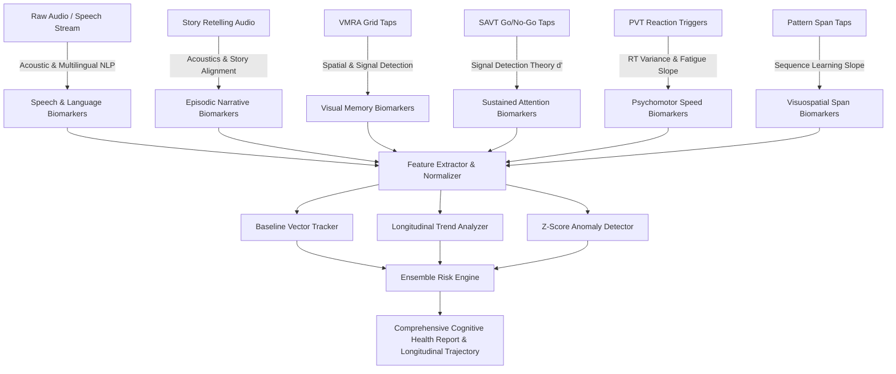

# VyomFlow Cognitive Assessment Suite
## Comprehensive Biomarker Reference Manual & Clinical Specifications

---

### Executive Overview

VyomFlow implements a multi-pillar, non-invasive digital biomarker extraction architecture designed for proactive, longitudinal cognitive monitoring. Rather than relying on static, one-time pass/fail screening, the system continuously analyzes **intra-individual variability (IIV)** across motor, acoustic, linguistic, episodic, and attentional domains.

This document compiles the exhaustive catalog of all **computational, acoustic, temporal, and neurocognitive biomarkers** extracted across all 7 assessment modules and the AI Longitudinal Risk Engine.

---

## 📑 Assessment Module Index

1. [Module 1: Multilingual Story Narration & Recall (StoryAssessment)](#module-1-multilingual-story-narration--recall-storyassessment)
2. [Module 2: Multilingual Spontaneous Language Assessment (LanguageAssessment)](#module-2-multilingual-spontaneous-language-assessment-languageassessment)
3. [Module 3: Visual Memory Recall Assessment (VMRA)](#module-3-visual-memory-recall-assessment-vmra)
4. [Module 4: Sustained Attention & Vigilance Test (SAVT / Go No-Go)](#module-4-sustained-attention--vigilance-test-savt--go-no-go)
5. [Module 5: Psychomotor Reaction Time Test (PVT)](#module-5-psychomotor-reaction-time-test-pvt)
6. [Module 6: Visual Pattern & Sequence Learning Assessment (PatternAssessment)](#module-6-visual-pattern--sequence-learning-assessment-patternassessment)
7. [Module 7: Verbal Short-Term Memory Assessment](#module-7-verbal-short-term-memory-assessment)
8. [Cross-Domain Longitudinal AI Fusion & Trend Biomarkers](#cross-domain-longitudinal-ai-fusion--trend-biomarkers)

---

## Module 1: Multilingual Story Narration & Recall (`StoryAssessment`)
**Target Neurocognitive Domains:** Episodic memory, narrative schema encoding, proposition retention, auditory comprehension, acoustic voice stability.

| Biomarker Name | Type | Mathematical / Computational Formulation | Clinical Significance |
| :--- | :--- | :--- | :--- |
| **Information Unit Recall Accuracy** (`recallAccuracy`) | Derived / Proportion | $\frac{\text{Matched Information Units}}{\text{Total Story Information Units}}$ | Measures thematic proposition retention from auditory narrative stimuli. |
| **Information Units Recalled** (`infoUnitsRecalled`) | Raw Count | Count of discrete key facts/events matched via keyword and semantic verification. | Direct index of episodic memory storage capacity. |
| **Omission Count** (`omissionCount`) | Raw Count | $\text{Total Units} - \text{Matched Units}$ | Quantitative measure of information decay and retrieval failure. |
| **False Recall / Confabulation Count** (`falseRecallCount`) | Raw Count | Unmatched propositions or invented narrative facts. | Identifies confabulatory intrusion, a classic marker of frontal/temporal memory dysfunction. |
| **Comprehension Accuracy** (`mcqAccuracy`) | Derived / Proportion | $\frac{\text{Correct MCQ Responses}}{\text{Total Questions}}$ | Differentiates between primary auditory comprehension deficits vs expressive recall retrieval failures. |
| **Comprehension Decision Latency** (`avgResponseTimeMs`) | Temporal (ms) | $\frac{1}{N} \sum_{i=1}^N \Delta t_{\text{response}, i}$ | Measures central processing speed during narrative query resolution. |
| **Story Sequence Alignment** (`storySequenceScore`) | Derived (0–1) | Normalized Kendall's tau rank correlation of recalled proposition order. | Evaluates executive temporal sequencing and chronological episodic organization. |
| **Narrative Completeness** (`narrativeCompleteness`) | Derived (0–1) | Coverage ratio across story arc phases (Introduction $\to$ Inciting Incident $\to$ Climax $\to$ Resolution). | Reflects macro-linguistic discourse planning and narrative structure integrity. |
| **Semantic & Lexical Similarity** (`similarityScore`) | Derived (0–1) | $\frac{\text{Jaccard Similarity} + \text{Levenshtein Normalized Score}}{2}$ | Measures preservation of precise semantic concepts and vocabulary from original story. |
| **Speech Rate** (`speechRateWPM`) | Temporal / Rate | $\frac{\text{Total Recalled Words}}{\text{Recording Duration (Minutes)}}$ | Detects psychomotor slowing or verbal cluttering during story reconstruction. |
| **Lexical Diversity** (`lexicalDiversity`) | Linguistic (TTR) | $\frac{\text{Unique Tokens}}{\text{Total Tokens}}$ | Type-Token Ratio during narrative recall; sensitive to vocabulary compression. |
| **Hesitation Rate** (`hesitationRate`) | Disfluency | $\frac{\text{Filler Words} + \text{Pauses}}{\text{Total Words}}$ | Reflects lexical search difficulties and cognitive retrieval load. |
| **Pause Frequency** (`pauseFrequency`) | Acoustic (Rate) | $\frac{\text{Pauses } (> 250\text{ms})}{\text{Duration (Minutes)}}$ | Quantitative acoustic marker of word-finding blocks and narrative stalling. |

---

## Module 2: Multilingual Spontaneous Language Assessment (`LanguageAssessment`)
**Target Neurocognitive Domains:** Expressive linguistic capacity, lexical retrieval, motor speech stability, acoustic voice dynamics, semantic coherence.

| Biomarker Name | Type | Mathematical / Computational Formulation | Clinical Significance |
| :--- | :--- | :--- | :--- |
| **Words Per Minute** (`wpm`) | Speech Rate | $\frac{\text{Word Count}}{\text{Total Duration (Minutes)}}$ | Standard conversational pacing metric. |
| **Articulation Rate** (`articulationRate`) | Speech Rate | $\frac{\text{Word Count}}{\text{Active Phonation Time (Minutes)}}$ | Isolates pure motor speech articulation velocity from silence/pause interruptions. |
| **Phonation Ratio** (`phonationRatio`) | Acoustic / Ratio | $\frac{\text{Active Speech Duration (ms)}}{\text{Total Duration (ms)}}$ | Proportion of time spent actively vocalizing; drops significantly in motor speech disorders and hesitation. |
| **Acoustic Pause Count** (`pauseCount`) | Acoustic Count | Number of detected silent intervals where RMS $< 0.015$ and duration $\ge 250\text{ms}$. | Cognitive hesitation events indicating lexical retrieval hesitation or motor speech fatigue. |
| **Average Pause Duration** (`pauseDurationAvg`) | Temporal (ms) | $\frac{\sum \text{Pause Durations}}{\text{Pause Count}}$ | Prolonged pause duration correlates with semantic search impairment. |
| **Root Type-Token Ratio** (`rootTTR`) | Linguistic Index | $\frac{\text{Unique Words}}{\sqrt{\text{Total Words}}}$ (Guiraud's Index) | Length-invariant index of vocabulary richness, eliminating sample-length bias. |
| **Multilingual Filler Word Count** (`fillerWordCount`) | Disfluency Count | Matches against Indic/English filler lexicons (*um, uh, मतलब, यार, வந்து, అంటే, அப்புறம், etc.*). | Verbal crutch frequency during spontaneous discourse. |
| **Repetitions & Stutters** (`repetitions`) | Disfluency Count | Count of adjacent identical tokens ($w_i = w_{i-1}$). | Motor speech disfluency and phonological loop re-starts. |
| **Hesitation Index** (`hesitationIndex`) | Disfluency Index | $\frac{\text{Fillers} + 1.5 \cdot \text{Reps} + 0.5 \cdot \text{Pauses}}{\text{Total Words}}$ | Standardized metric of total discourse disruption. |
| **Fluency Score** (`fluencyIndex`) | Composite (0–100) | $100 - (\text{Hesitation Penalty}) - (\text{WPM Deviation Penalty})$ | Calibrated fluency index normalized to optimal conversational range (110–160 WPM). |
| **Semantic Prompt Coherence** (`semanticCoherence`) | Semantic (0–100) | Keyword & semantic vector alignment with prompt theme. | Evaluates thematic continuity, topic maintenance, and tangential discourse drift. |
| **Syntactic Complexity** (`syntacticComplexity`) | Linguistic (0–100) | Mean Length of Utterance (MLU) + syntactic clause complexity. | Detects syntactic simplification and telegraphic speech patterns. |
| **Idea Density / Propositional Density** (`ideaDensity`) | Semantic Ratio | $\frac{\text{Content Words (Nouns, Verbs, Adj, Adv)}}{\text{Total Words}}$ | Ratio of substantive information units to function words; early marker of Alzheimer's disease. |
| **Motor Speech Stability** (`speechStability`) | Acoustic (0–100) | $(\text{PhonationRatio} \times 60) + ((1 - \text{HesitationIndex}) \times 40)$ | Evaluates vocal tract motor stability and fluency consistency. |
| **Cognitive Speech Index** (`cognitiveSpeechIndex`) | Composite (0–100) | $0.30 \cdot \text{Fluency} + 0.25 \cdot \text{Acoustics} + 0.20 \cdot \text{Lexical} + 0.15 \cdot \text{Semantic} + 0.10 \cdot \text{Syntax}$ | Comprehensive, multi-pillar composite score of overall speech-cognitive integrity. |

---

## Module 3: Visual Memory Recall Assessment (`VMRA`)
**Target Neurocognitive Domains:** Visual episodic memory, short-term visual retention, pattern separation, distractor inhibition, spatial scanning.

| Biomarker Name | Type | Mathematical / Computational Formulation | Clinical Significance |
| :--- | :--- | :--- | :--- |
| **Visual Recall Accuracy** (`recallAccuracy`) | Proportion (0–1) | $\frac{\text{Correct Target Hits}}{\text{Total Presented Targets}}$ | Primary visual memory encoding and retrieval accuracy. |
| **False Positive Rate** (`falsePositiveRate`) | Proportion (0–1) | $\frac{\text{False Positive Selections}}{\text{Total Distractors in Grid}}$ | Susceptibility to visual interference and impaired pattern separation. |
| **Precision** (`precision`) | Derived (0–1) | $\frac{\text{Correct Hits}}{\text{Correct Hits} + \text{False Positives}}$ | Exactness of visual recognition memory. |
| **F1 Score** (`f1Score`) | Harmonic Mean | $\frac{2 \cdot \text{Precision} \cdot \text{Recall}}{\text{Precision} + \text{Recall}}$ | Balanced metric of visual memory sensitivity and specificity. |
| **Net Recall Score** (`netRecallScore`) | Penalized Count | $\max(0, \text{Hits} - \text{False Positives})$ | Guess-penalized visual memory capacity score. |
| **First Tap Latency** (`firstTapLatencyMs`) | Temporal (ms) | $t_{\text{first\_tap}} - t_{\text{recall\_start}}$ | Decision latency and retrieval initiation hesitation. |
| **Mean Selection Latency** (`meanSelectionLatencyMs`) | Temporal (ms) | $\frac{1}{K} \sum_{k=1}^K (t_k - t_{\text{start}})$ | Central visual scanning and identification speed. |
| **Mean Inter-Tap Interval** (`meanInterTapIntervalMs`) | Temporal (ms) | $\frac{1}{K-1} \sum_{k=2}^K (t_k - t_{k-1})$ | Rhythmicity and fluid pacing of item selection. |
| **Latency Variance** (`latencyVariance`) | Temporal (SD) | $\sqrt{\frac{1}{K} \sum (t_k - \bar{t})^2}$ | Micro-fluctuations in visual attention and decision confidence. |
| **Primacy Bias** (`primacyBias`) | Serial Position | $\frac{\text{Hits in First 2 Encoded Items}}{2}$ | Integrity of long-term consolidation and transfer from working memory. |
| **Recency Bias** (`recencyBias`) | Serial Position | $\frac{\text{Hits in Last 2 Encoded Items}}{2}$ | Integrity of short-term visual working memory buffer. |
| **Mid-List Deficit** (`midListDeficit`) | Serial Position | $1 - \frac{\text{Hits in Middle Encoded Items}}{\text{Total Middle Items}}$ | Typical serial-position trough; elevated deficit indicates encoding capacity compression. |
| **Confusion Pairs** (`confusionPairs`) | Error Analysis | Pairs of targets and selected distractors sharing semantic/visual similarity. | Quantifies fine-grained visual feature discrimination impairment. |
| **Intrusion Errors** (`intrusionErrors`) | Error Count | Count of selected distractors with zero visual/semantic overlap with any target. | Random response or severe visual memory distortion marker. |
| **Spatial Bias** (`spatialBias`) | Spatial Analysis | Ratio of taps in Top vs Bottom, Left vs Right grid quadrants. | Detects visual field neglect, directional scanning preferences, or hemi-inattention. |
| **Grid Coverage** (`gridCoverage`) | Spatial Proportion | $\frac{\text{Interacted Grid Cells}}{\text{Total Grid Cells}}$ | Reflects systematic vs chaotic search strategy across the visual display. |
| **Delayed Recall Ratio** (`delayedRecallRatio`) | Retention Metric | $\frac{\text{Delayed Recall Accuracy}}{\text{Immediate Recall Accuracy}}$ | Measures consolidation and memory retention over time. |
| **Forgetting Curve Slope** (`forgettingCurveSlope`) | Decay Slope | $\frac{\Delta \text{Accuracy}}{\Delta t_{\text{delay}}}$ | Slope of visual memory decay over time intervals. |

---

## Module 4: Sustained Attention & Vigilance Test (`SAVT` / Go No-Go)
**Target Neurocognitive Domains:** Sustained attention, vigilance decrement, motor response inhibition, signal detection sensitivity ($d'$), impulsivity.

| Biomarker Name | Type | Mathematical / Computational Formulation | Clinical Significance |
| :--- | :--- | :--- | :--- |
| **Signal Detection Sensitivity ($d'$)** (`dPrime`) | SDT Metric | $z(\text{Hit Rate}) - z(\text{False Alarm Rate})$ | Pure perceptual and attentional sensitivity; separates true discriminability from response bias. |
| **Response Criterion ($\beta$ / $C$)** (`responseBias`) | SDT Metric | $-\frac{z(\text{Hit Rate}) + z(\text{False Alarm Rate})}{2}$ | Quantifies conservative (cautious) vs liberal (impulsive) decision threshold. |
| **Hit Rate** (`hitRate`) | Proportion (0–1) | $\frac{\text{Correct Go Responses}}{\text{Total Go Trials}}$ | Sustained visual target engagement. |
| **Commission Error Rate** (`commissionErrorRate` / `falseAlarmRate`) | Proportion (0–1) | $\frac{\text{Responses to No-Go Stimuli}}{\text{Total No-Go Trials}}$ | **Inhibitory Control & Impulsivity Marker:** Failure of frontal motor suppression circuits. |
| **Omission Error Rate** (`omissionErrorRate` / `missRate`) | Proportion (0–1) | $\frac{\text{Missed Go Stimuli}}{\text{Total Go Trials}}$ | **Inattention Marker:** Brief lapses in attention or micro-sleep episodes. |
| **Mean Response Time** (`meanResponseTimeMs`) | Temporal (ms) | $\frac{1}{N} \sum \text{RT}_{\text{Go}}$ | Processing speed for correct Go executions. |
| **Median Response Time** (`medianResponseTimeMs`) | Temporal (ms) | $\text{Median}(\text{RT}_{\text{Go}})$ | Outlier-resilient processing speed index. |
| **RT Standard Deviation** (`rtVariability`) | Temporal (SD) | $\sigma_{\text{RT}}$ | Intra-individual response time variability; sensitive marker of frontal-subcortical integrity. |
| **RT Coefficient of Variation** (`rtCoefficientOfVariation`) | Ratio | $\frac{\sigma_{\text{RT}}}{\mu_{\text{RT}}}$ | Normalized response variability; rises sharply in attention deficit and prodromal neurodegeneration. |
| **Vigilance Decrement** (`vigilanceDecrement`) | Linear Slope | Slope ($m$) of Hit Rate across Blocks 1 $\to$ 4 | Quantifies decay of sustained attention over time (attentional fatigue). |
| **Vigilance Stability** (`vigilanceStability`) | Composite (0–1) | Consistency of performance and RT across 4 test blocks. | Measures stamina and endurance of the executive attentional network. |

---

## Module 5: Psychomotor Reaction Time Test (`PVT`)
**Target Neurocognitive Domains:** Central nervous system processing speed, psychomotor alertness, attention stability, neuromuscular fatigue.

| Biomarker Name | Type | Mathematical / Computational Formulation | Clinical Significance |
| :--- | :--- | :--- | :--- |
| **Mean Reaction Time** (`avg`) | Temporal (ms) | $\frac{1}{N} \sum_{i=1}^N \text{RT}_i$ | Baseline psychomotor reaction latency. |
| **Median Reaction Time** (`median`) | Temporal (ms) | $\text{Median}(\text{RT})$ | Robust central tendency metric for psychomotor speed. |
| **Fastest Reaction Time** (`fastest`) | Temporal (ms) | $\min(\text{RT})$ | Optimum neuromuscular processing speed ceiling. |
| **Slowest Reaction Time** (`slowest`) | Temporal (ms) | $\max(\text{RT})$ | Maximum psychomotor delay or attentional lapse magnitude. |
| **Reaction Variance** (`variance`) | Statistical (ms$^2$) | $\frac{1}{N} \sum (\text{RT}_i - \bar{\text{RT}})^2$ | Unpredictability in neuromuscular response latency. |
| **Stability Index** (`stabilityIndex`) | Derived (0–1) | $1 - \frac{\sqrt{\text{Variance}}}{\text{Mean RT}}$ | Measures consistency of neuro-motor responses (1 = perfectly stable). |
| **Fatigue Slope** (`fatigueSlope`) | Linear Slope | $\frac{\sum (i - \bar{i})(\text{RT}_i - \bar{\text{RT}})}{\sum (i - \bar{i})^2}$ | Linear acceleration of reaction time across successive trials (neuromuscular fatigue). |
| **Attention Variability** (`attentionVariability`) | Error/Variance Ratio | $\frac{\text{False Starts} + \text{Misses}}{N} + \frac{CV}{2}$ | Combined metric of attentional lapses and motor inconsistency. |
| **Baseline Deviation** (`baselineDeviation`) | Longitudinal Delta | $\frac{\text{Current Avg RT} - \text{Baseline Avg RT}}{\text{Baseline Avg RT}}$ | Intra-individual deviation from personal baseline; identifies acute or gradual psychomotor slowing. |
| **False Starts / Anticipation Errors** (`falseStartCount`) | Error Count | Taps registered prior to visual stimulus presentation ($< 150\text{ms}$). | Measures motor impulsivity and anticipatory guessing. |
| **Missed Stimuli** (`missedStimulusCount`) | Error Count | Trials where response exceeded timeout window ($> 1500\text{ms}$). | Attentional lapses or severe processing delays. |
| **Anomaly Score** (`anomalyScore`) | Composite (0–1) | Weighted combination of baseline deviation, fatigue slope, and stability loss. | Highlights abnormal sessions requiring longitudinal clinical review. |

---

## Module 6: Visual Pattern & Sequence Learning Assessment (`PatternAssessment`)
**Target Neurocognitive Domains:** Visuospatial working memory, non-verbal sequence learning, spatial span, cognitive load tolerance.

| Biomarker Name | Type | Mathematical / Computational Formulation | Clinical Significance |
| :--- | :--- | :--- | :--- |
| **Max Level / Sequence Span** (`maxLevelReached`) | Capacity Count | Longest sequential pattern correctly reproduced. | Visual memory span equivalent (spatial Corsi block span). |
| **Average Response Latency** (`averageResponseLatency`) | Temporal (ms) | Time elapsed before the first tile click in a sequence round. | Visuospatial planning and pattern retrieval latency. |
| **Average Completion Time** (`averageCompletionTime`) | Temporal (ms) | Total time to execute complete sequential tile sequence. | Motor execution and visual path tracing speed. |
| **Learning Rate** (`learningRate`) | Dynamic Rate | $-\text{Slope}(\frac{\text{Completion Time}}{\text{Sequence Length}})$ | Rate of speed and efficiency acquisition across repeated rounds within task. |
| **Memory Load Tolerance** (`memoryLoadTolerance`) | Proportion (%) | $\frac{\text{Correct Rounds at Length } \ge (\text{Max} - 1)}{\text{Total Near-Max Rounds}} \times 100$ | Robustness of working memory under high cognitive load conditions. |
| **Pattern Stability Index** (`patternStabilityIndex`) | Derived (0–100) | $\max(0, 100 - \frac{\sigma_{\text{Latency}}}{10})$ | Consistency of retrieval strategy across varying sequence difficulties. |
| **Error Growth Rate** (`errorGrowthRate`) | Dynamic Ratio | $\frac{\text{Errors}_{\text{Second Half}} - \text{Errors}_{\text{First Half}}}{\text{Half Rounds}}$ | Measures vulnerability to cognitive overload as sequence length scales. |
| **Input Error Count** (`inputErrors`) | Error Count | Total erroneous tile taps across all rounds. | Cumulative spatial working memory breakdown count. |

---

## Module 7: Verbal Short-Term Memory Assessment (Word Recall)
**Target Neurocognitive Domains:** Immediate verbal recall, phonological working memory, intrusion susceptibility, retroactive interference.

| Biomarker Name | Type | Mathematical / Computational Formulation | Clinical Significance |
| :--- | :--- | :--- | :--- |
| **Word Recall Accuracy** (`recallAccuracy`) | Proportion (0–1) | $\frac{\text{Correct Recalled Words}}{\text{Total Presented Words}}$ | Immediate phonological and verbal memory recall capacity. |
| **Intrusion Rate** (`intrusionRate`) | Error Ratio (0–1) | $\frac{\text{False Recalls}}{\text{Total Recalled Words}}$ | Tendency to produce non-presented words (confabulations). |
| **Forgetting Rate** (`forgettingRate`) | Proportion (0–1) | $\frac{\text{Omitted Words}}{\text{Total Presented Words}}$ | Immediate memory decay and verbal omission rate. |
| **Duplicate / Perseveration Count** (`duplicateCount`) | Error Count | Count of repeated recall words in a single trial. | Executive perseveration and failure to track output buffer. |
| **Interference Score** (`interferenceScore`) | Retention Metric | Accuracy drop following secondary distractor task. | Measures vulnerability to retroactive interference in working memory. |
| **Recall Latency Index** (`latencyIndex`) | Temporal (0–1) | $\min(1.0, \frac{\text{Response Latency (ms)}}{45000})$ | Verbal retrieval speed and mental search effort. |
| **Recall Consistency** (`recallConsistency`) | Longitudinal (0–1) | $1 - 2 \cdot |\text{Current Accuracy} - \text{Historical Mean}|$ | Multi-session verbal memory stability. |

---

## Cross-Domain Longitudinal AI Fusion & Trend Biomarkers

The VyomFlow AI Engine (`src/ai/`) fuses all individual module biomarkers into multi-dimensional longitudinal trend metrics.

### Longitudinal Fusion Biomarkers:
1. **Memory Trend Slope** ($m_{\text{memory}}$): Linear regression slope of memory accuracy over timestamped sessions ($m < -0.001$ indicates decline).
2. **Reaction Trend Slope** ($m_{\text{reaction}}$): Linear regression slope of psychomotor latency ($m < -0.001$ indicates slowing).
3. **Pattern Trend Slope** ($m_{\text{pattern}}$): Long-term trajectory of visuospatial span capacity.
4. **Language Trend Slope** ($m_{\text{language}}$): Longitudinal trajectory of Cognitive Speech Index (CSI) and Root TTR.
5. **Delta Vector** ($\Delta$): Instantaneous multi-dimensional deviation from user's personalized baseline vector $[\Delta_{\text{mem}}, \Delta_{\text{rxn}}, \Delta_{\text{pat}}, \Delta_{\text{lang}}]$.
6. **Mahalanobis / Z-Score Anomaly Metric** ($z_{\text{anomaly}}$): Detects acute multi-domain drops (e.g., $z > 2.0$) distinguishing acute events (poor sleep/distraction) from chronic slope changes.
7. **Risk Confidence Score**: Bayesian confidence weighting based on testing frequency, sample size, and measurement consistency.

---

### Regulatory & Clinical Disclaimer
*VyomFlow and its extracted digital biomarkers are designed for longitudinal cognitive health awareness, research, and self-monitoring. They do not constitute a standalone diagnostic device. Any persistent anomalous trend signals should be reviewed with a qualified healthcare professional or clinical neuropsychologist.*
